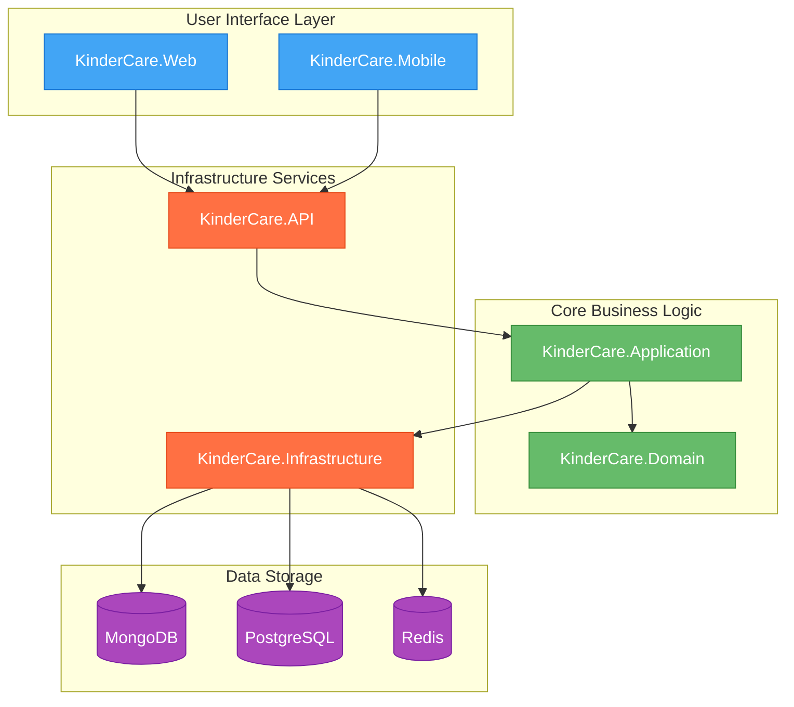

# KinderCare Enterprise Technology Modernization

## Executive Summary

This document outlines a comprehensive technology modernization strategy for KinderCare's digital ecosystem. The proposed unified enterprise technology stack aims to consolidate disparate systems, enhance operational efficiency, and deliver superior experiences for staff, parents, and children. This modernization initiative will position KinderCare as a technology leader in the childcare industry while creating a scalable foundation for future growth.

## Current Technology Landscape

KinderCare currently operates multiple technology platforms that serve different business functions:

- Talent Acquisition Platform
          - Career site management
  - Content management system
  - Candidate relationship management
  - Talent analytics and reporting
  - Applicant engagement tools


- Parent Communication System
          - Messaging capabilities
  - Photo sharing
  - Daily activity reporting
  - Real-time updates


- Operations Management Systems
          - Attendance tracking
  - Billing and payment processing
  - Staff scheduling
  - Resource allocation


- Financial Planning Tools
          - Budgeting processes
  - Price modeling
  - Labor scheduling
  - Financial analysis


## Proposed Unified Enterprise Technology Stack

### Frontend Architecture

- React Framework
- Component-based architecture for maximum code reusability
- Virtual DOM implementation for optimal rendering performance
- Extensive ecosystem of libraries and tools
- Cross-platform capabilities via React Native

### Backend Architecture

- Google Go (Golang)
- High-performance compiled language
- Concurrent processing capabilities
- Memory-efficient operation
- Simplified deployment and maintenance

### Data Management

- Hybrid Database Solution
          - MongoDB for flexible, document-based storage
  - PostgreSQL for transactional data requiring ACID compliance
  - Redis for caching and session management
  - Data warehouse for analytics and reporting


### Infrastructure

- Cloud-Native Architecture
- Containerized applications using Kubernetes
- Serverless functions for event-driven processes
- Auto-scaling capabilities to handle variable loads
- Geographic redundancy for high availability

### Integration Framework

- API Management Platform
- RESTful and GraphQL API support
- Centralized authentication and authorization
- Rate limiting and traffic management
- Comprehensive monitoring and analytics

## Implementation Roadmap

### Phase 1: Foundation (Months 1-3)

- Establish cloud infrastructure
- Implement core API gateway
- Develop authentication and authorization services
- Create initial data migration strategy

### Phase 2: Core Services (Months 4-8)

- Develop parent communication platform
- Implement staff management system
- Build enrollment and attendance tracking
- Create financial management modules

### Phase 3: Advanced Features (Months 9-12)

- Deploy AI-powered analytics
- Implement IoT integration framework
- Enhance security features
- Develop mobile applications

### Phase 4: Transition (Months 13-18)

- Migrate legacy data
- Parallel operation of systems
- Staff training and onboarding
- Gradual decommissioning of legacy platforms

## Project Structure and Architecture

The solution follows Clean Architecture principles with a clear separation of concerns. This architecture ensures that business logic remains independent of external frameworks, databases, and UI technologies, making the system more maintainable and testable.




The diagram above illustrates our Clean Architecture implementation, where:

- Blue components represent the UI layer (Web and Mobile interfaces)
- Green components show the Core Business Logic layer containing domain entities and application services
- Orange components indicate Infrastructure Services handling API and external communications
- Purple components represent Data Storage solutions

Arrows indicate dependencies flowing inward, ensuring that outer layers depend on inner layers rather than vice versa, maintaining architectural integrity and testability.

## Project Setup with PowerShell

The following PowerShell script creates the initial project structure:

```powershell
# Create the main project directory
New-Item -Path "KinderCare.Enterprise" -ItemType Directory
Set-Location -Path "KinderCare.Enterprise"

# Create source code directory structure
New-Item -Path "src" -ItemType Directory
Set-Location -Path "src"

# Create core project directories
$projectDirs = @(
    "KinderCare.Domain",
    "KinderCare.Application",
    "KinderCare.Infrastructure",
    "KinderCare.API",
    "KinderCare.Web",
    "KinderCare.Mobile"
)

foreach ($dir in $projectDirs) {
    New-Item -Path $dir -ItemType Directory
}

# Create test directory structure
Set-Location -Path ".."
New-Item -Path "tests" -ItemType Directory
Set-Location -Path "tests"

# Create test project directories
$testDirs = @(
    "KinderCare.Domain.Tests",
    "KinderCare.Application.Tests",
    "KinderCare.Infrastructure.Tests",
    "KinderCare.API.Tests"
)

foreach ($dir in $testDirs) {
    New-Item -Path $dir -ItemType Directory
}

# Create tools directory for CI/CD scripts
Set-Location -Path ".."
New-Item -Path "tools" -ItemType Directory

# Return to the main directory
Set-Location -Path ".."

Write-Host "Project structure created successfully!" -ForegroundColor Green
```

## Architecture Principles

The architecture adheres to the following principles:

### SOLID Principles

- Single Responsibility: Each class has only one reason to change
- Open/Closed: Open for extension, closed for modification
- Liskov Substitution: Subtypes must be substitutable for their base types
- Interface Segregation: Clients shouldn't depend on interfaces they don't use
- Dependency Inversion: High-level modules don't depend on low-level modules

### Domain-Driven Design (DDD)

- Focus on the core domain and domain logic
- Collaboration with domain experts
- Creation of a ubiquitous language
- Model-driven design

### Clean Architecture

- Independence of frameworks
- Testability without external elements
- Independence of UI
- Independence of database
- Independence of external agencies

### 12-Factor App Methodology

- Codebase: One codebase tracked in version control, many deployments
- Dependencies: Explicitly declare and isolate dependencies
- Config: Store configuration in the environment
- Backing services: Treat backing services as attached resources
- Build, release, run: Strictly separate build and run stages
- Processes: Execute the app as one or more stateless processes
- Port binding: Export services via port binding
- Concurrency: Scale out via the process model
- Disposability: Maximize robustness with fast startup and graceful shutdown
- Dev/prod parity: Keep development, staging, and production as similar as possible
- Logs: Treat logs as event streams
- Admin processes: Run admin/management tasks as one-off processes

### Gang of Four Design Patterns

- Creational patterns for object creation
- Structural patterns for object composition
- Behavioral patterns for object interaction

## Core Domain Implementation

The domain layer is the heart of the system, containing the business logic and rules. It is independent of any external frameworks or technologies.

Setting Up the Domain Layer:

```powershell
# Navigate to the domain project directory
Set-Location -Path "KinderCare.Enterprise\src\KinderCare.Domain"

# Create domain layer structure
$domainDirs = @(
    "entities",
    "repositories",
    "services",
    "events",
    "exceptions",
    "valueobjects"
)

foreach ($dir in $domainDirs) {
    New-Item -Path $dir -ItemType Directory
}
```

Implementing Core Domain Entities:

```go
// src/KinderCare.Domain/entities/child.go
package entities

import (
    "time"
    "github.com/google/uuid"
)

// Child represents a child enrolled in KinderCare
type Child struct {
    ID            uuid.UUID
    FirstName     string
    LastName      string
    DateOfBirth   time.Time
    EnrollmentDate time.Time
    Guardians     []*Guardian
    Attendance    []*Attendance
    DailyReports  []*DailyReport
    ClassroomID   uuid.UUID
}

// NewChild creates a new Child entity
func NewChild(firstName, lastName string, dateOfBirth time.Time) *Child {
    return &Child{
        ID:            uuid.New(),
        FirstName:     firstName,
        LastName:      lastName,
        DateOfBirth:   dateOfBirth,
        EnrollmentDate: time.Now(),
        Guardians:     make([]*Guardian, 0),
        Attendance:    make([]*Attendance, 0),
        DailyReports:  make([]*DailyReport, 0),
    }
}

// FullName returns the child's full name
func (c *Child) FullName() string {
    return c.FirstName + " " + c.LastName
}

// Age calculates the child's age
func (c *Child) Age() int {
    now := time.Now()
    years := now.Year() - c.DateOfBirth.Year()
    
    if now.Month() < c.DateOfBirth.Month() || 
       (now.Month() == c.DateOfBirth.Month() && now.Day() < c.DateOfBirth.Day()) {
        years--
    }
    
    return years
}

// AddGuardian adds a guardian to the child
func (c *Child) AddGuardian(guardian *Guardian) {
    c.Guardians = append(c.Guardians, guardian)
}

// AddAttendance adds an attendance record to the child
func (c *Child) AddAttendance(attendance *Attendance) {
    c.Attendance = append(c.Attendance, attendance)
}

// AddDailyReport adds a daily report to the child
func (c *Child) AddDailyReport(report *DailyReport) {
    c.DailyReports = append(c.DailyReports, report)
}

// AssignToClassroom assigns the child to a classroom
func (c *Child) AssignToClassroom(classroomID uuid.UUID) {
    c.ClassroomID = classroomID
}

// ... Additional entity implementations for Guardian, Staff, Attendance, DailyReport, and Classroom
```

Defining Domain Repositories:

```go
// src/KinderCare.Domain/repositories/child_repository.go
package repositories

import (
    "context"
    "github.com/google/uuid"
    "kindercare/domain/entities"
)

// ChildRepository defines the interface for child data access
type ChildRepository interface {
    GetByID(ctx context.Context, id uuid.UUID) (*entities.Child, error)
    GetAll(ctx context.Context) ([]*entities.Child, error)
    GetByGuardianID(ctx context.Context, guardianID uuid.UUID) ([]*entities.Child, error)
    GetByClassroomID(ctx context.Context, classroomID uuid.UUID) ([]*entities.Child, error)
    Create(ctx context.Context, child *entities.Child) error
    Update(ctx context.Context, child *entities.Child) error
    Delete(ctx context.Context, id uuid.UUID) error
}

// Similar repository interfaces exist for Guardian, Staff, Attendance, DailyReport, and Classroom entities
```
